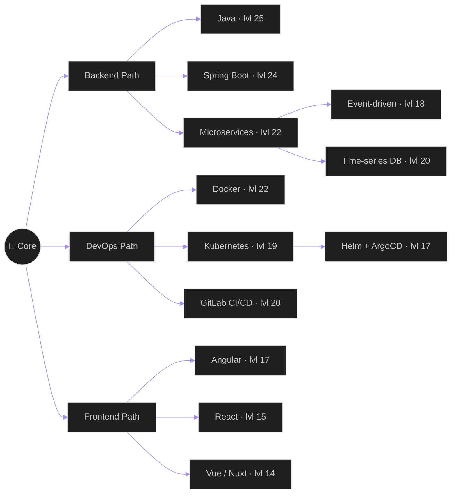

<!--
  GitHub Profile README — Abdelkarim El Bouroumi
  Concept: RPG character sheet. A different metaphor from your portfolio.

  Setup:
  1. Create a repo named EXACTLY your GitHub username (e.g. karimloco4/karimloco4)
  2. Drop this file in as README.md
  3. Find/replace YOUR_USERNAME with your real handle (8 spots)
  4. Replace YOUR_LINKEDIN with your linkedin slug
-->

<div align="center">

# ⚔️ Abdelkarim "Karim" El Bouroumi

### `CLASS: Backend Mage` &nbsp;·&nbsp; `LEVEL: 25` &nbsp;·&nbsp; `GUILD: Norsys`

<br/>


</div>

<br/>

---

## 📜 &nbsp; Character Lore

> A wandering engineer from the coastal lands of **Bouznika, Morocco** 🇲🇦.
> Trained in the ancient arts of **Java** and **Spring Boot**, now serving in the **Norsys guild of Marrakech**.
> Known across the kingdom for taming wild microservices and modeling **time-series databases** that don't OOM at 3 AM.
> Currently on a long campaign to ship the **ROOOX** voice & chatbot platform — slaying bugs and writing tests along the way.

---

## 📊 &nbsp; Base Stats

```yaml
INT (Intelligence)   : ▰▰▰▰▰▰▰▰▰░  90   # debug-mode brain
DEX (Dexterity)      : ▰▰▰▰▰▰▰▰░░  82   # 120 wpm in IntelliJ
CON (Constitution)   : ▰▰▰▰▰▰▰▰▰▰ 100   # caffeine immunity, lvl max
WIS (Wisdom)         : ▰▰▰▰▰▰▰▰░░  84   # learns from every prod incident
CHA (Charisma)       : ▰▰▰▰▰▰▰░░░  73   # tolerable code reviewer
LCK (Luck)           : ▰▰▰▰░░░░░░  42   # deploys on Friday at own risk
```

---

## 🌳 &nbsp; Skill Tree



---

## 🎒 &nbsp; Inventory

| Slot | Item | Rarity | Effect |
|---|---|---|---|
| 🗡️ Main weapon | **Java 21** | ★★★★★ Legendary | +21 to backend damage, never expires |
| 🛡️ Armor | **Spring Boot** | ★★★★★ Legendary | Autoconfigure all the things |
| 🪄 Wand | **PostgreSQL** | ★★★★☆ Epic | Summons time-series tables on cast |
| 📜 Spellbook | **Kubernetes** | ★★★★☆ Epic | Orchestrates loyal minions (pods) |
| 🧪 Potion | **Caffeine** | ★★★☆☆ Rare | +∞ focus for 4h, mild withdrawal after |
| 🎧 Trinket | **Lo-fi playlist** | ★★★☆☆ Rare | Concentration buff, dispels meetings |
| 💍 Ring | **Git** | ★★★★★ Legendary | Time travel ability (only forward in practice) |

---

## ⚔️ &nbsp; Active Quests

<table>
<tr>
<th width="50%">🟢 Main Quest</th>
<th width="50%">🟡 Side Quests</th>
</tr>
<tr>
<td>

**Ship the ROOOX platform**
- ✅ Design the callbot (voice bot)
- ✅ Partition the time-series DB
- ✅ Caffeine cache + perf tuning
- 🔄 Stats APIs by intent / hour
- ⬜ Multi-tenant orchestration

</td>
<td>

**Level up these skills**
- 🔄 Master GitOps with ArgoCD
- 🔄 Kafka Streams patterns
- ⬜ Domain-Driven Design
- ⬜ Rust (for the lolz)
- ⬜ Read *Designing Data-Intensive Applications*

</td>
</tr>
</table>

---

## 🏆 &nbsp; Achievements Unlocked

| Badge | Achievement | Date |
|:---:|---|---|
| 🎖️ | **First Production Deploy** — without crashing the cluster | 2023 |
| 🛡️ | **Bug Slayer** — fixed a critical prod bug in <30 min | 2024 |
| 🔮 | **Migration Master** — AngularJS → React, no data loss | 2023 |
| ⚙️ | **Microservice Whisperer** — orchestrated 6 services in harmony | 2024 |
| 🎓 | **Master of Information Systems** — FSS Marrakech | 2024 |
| 🌍 | **Polyglot** — fluent in 3 spoken languages, 6+ programming | always |
| ☕ | **The Caffeinated** — survived a 12h deploy window | 2024 |
| 🚀 | **GitOps Initiate** — Lyon, 15 days, CNAM | 2025 |

---

## 📓 &nbsp; Quest Log &mdash; Real World Stats

<div align="center">

<a href="https://github.com/YOUR_USERNAME">
  
  
</a>

<br/><br/>


</div>

---

## 🗣️ &nbsp; Languages Known (the human kind)

```yaml
العربية (Arabic)  : ▰▰▰▰▰▰▰▰▰▰  native tongue
Français          : ▰▰▰▰▰▰▰▰▰░  advanced (TCF B2 · 426)
English           : ▰▰▰▰▰▰▰▰░░  upper intermediate
JavaScript        : ▰▰▰▰▰▰▰▰░░  fluent (the cursed sublanguage)
```

---

## 🎮 &nbsp; Off-Duty Pursuits

When not slaying bugs, you'll find this character:

- 🎵 **At a concert** — live music charges my mana
- 🎬 **Watching cinema** — story craft fuels system design
- 🎮 **Gaming** — RPGs and strategy (it shows)
- 📚 **Reading tech blogs** — engineering blog enjoyer
- 🔭 **Tinkering** — late-night side projects in random languages

---

## 📡 &nbsp; Send a Raven

<div align="center">

[](mailto:karimloco4@gmail.com)
[](https://linkedin.com/in/YOUR_LINKEDIN)
[](https://wa.me/212674723937)
[](https://YOUR_USERNAME.github.io)

</div>

---

<div align="center">

### 🎲 &nbsp; Currently rolling for initiative on cool projects.

<sub><em>Profile last updated by IRL Abdelkarim, somewhere between Marrakech and a deploy window.</em></sub>

<br/>


</div>
